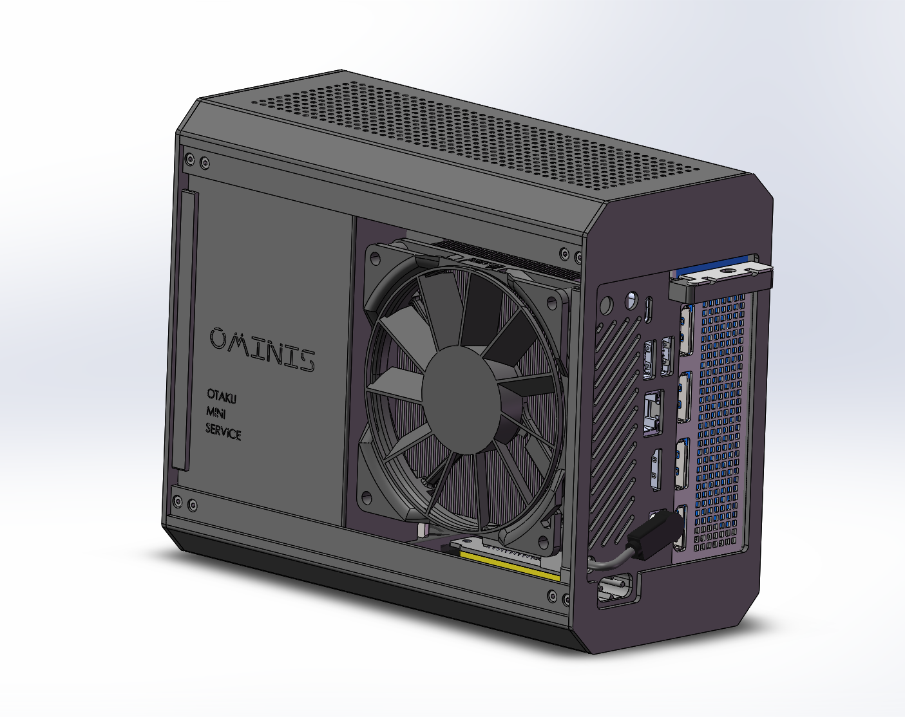
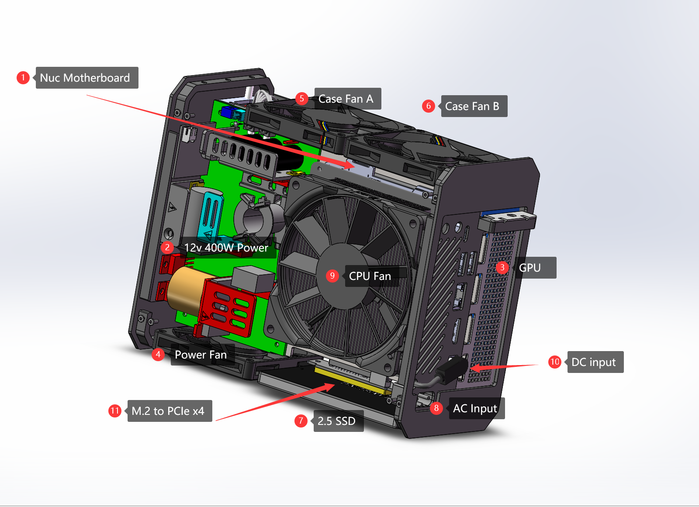
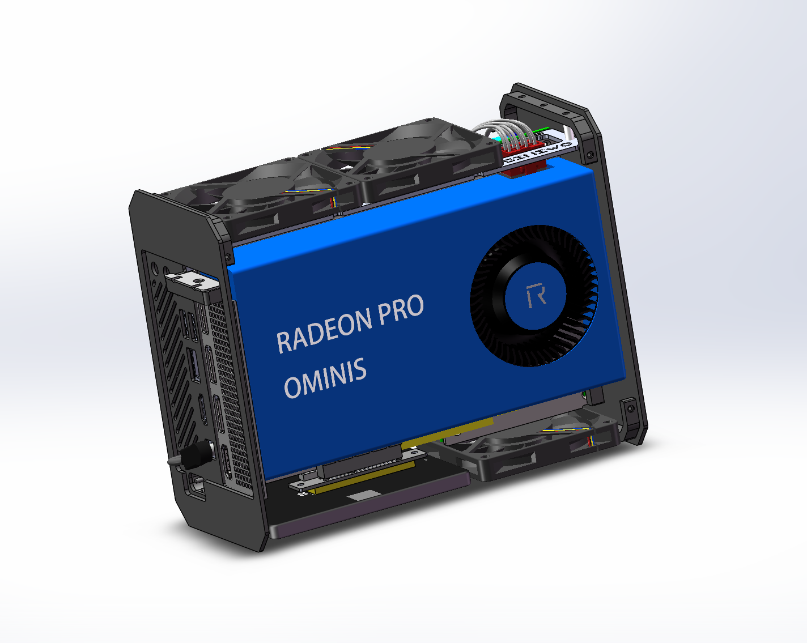
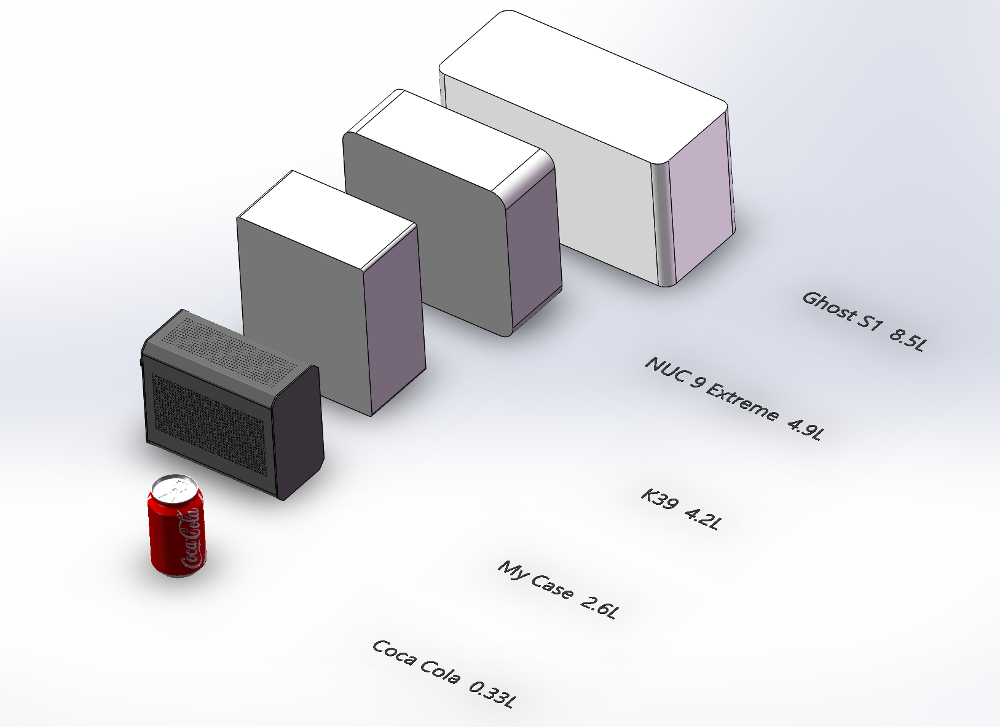
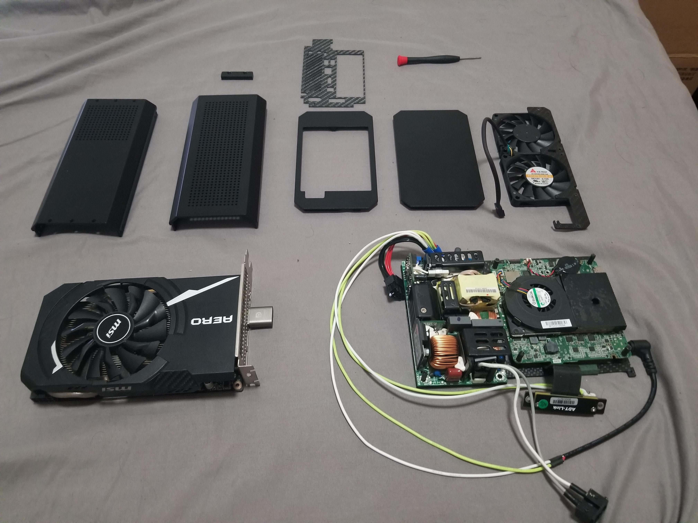
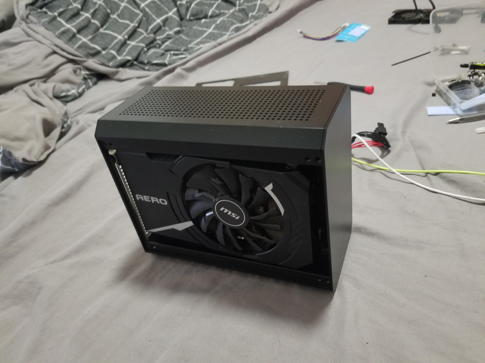

# GP44-Case
* 各位B站小伙伴以及Otermi社团的lsp们大家好。我是翻车王solayuta 
* GP44 CASE == (内置GPU + 内置Power + 4x4英寸主板的机箱).一台电脑对于阿宅来说必不可少,最近几年ITX主机的地位在PC圈子里提高很多,特别是便携显示器,小尺寸械键盘的普及完善了小主机的体验,除了对空间占用比较敏感的学生狗之外,对于发烧友来说迷你主机也是一种小巧精致的大号手办.
* 它代替不了笔记本以及ITX，但是我希望成为一个新标准.如果两轮电动车能满足你的需求还要什么千匹拖拉机?

## 计划
* 目标是设计一个可以自由更换标准件的机箱
* 它比技嘉雷电扩展坞3.4L 或NUC9幽灵峡谷4.9L更小
* 它可以是x86软路由/游戏串流服务器/远程工作站

## 规格
* 体积2.6升 156x192x90mm
* 主板:带有Intel或AMD的4x4英寸 NUC主板
* 显卡:尺寸MAX 186x122mm 2槽
* 电源:12v 4x3英寸 400w工业电源
* 风扇:3x7010
* CPU散热器:LGA2011（已经废弃）未来会按照原装散热器改进
* 存储:1x2.5 SATA USB3.1gen2 to M.2 SSD

## 更多信息
* [B站](https://www.bilibili.com/video/BV1M54y1r7a9)
* [贴吧](https://tieba.baidu.com/p/6889419268?red_tag=2137515648)
* [Reddit](https://www.reddit.com/r/intelnuc/comments/je420p/nuc_gpu_power_my_case/)
* [Otermi 御宅终端-QQ群](https://jq.qq.com/?_wv=1027&k=Fa0sCnyl)

## 图片

