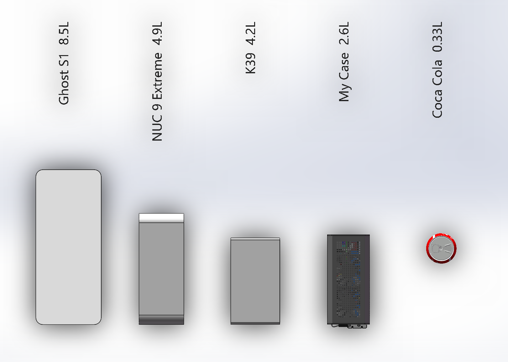

<iframe width="1217" height="685" src="https://www.youtube.com/embed/96lQVkUwZIs" title="YouTube video player" frameborder="0" allow="accelerometer; autoplay; clipboard-write; encrypted-media; gyroscope; picture-in-picture" allowfullscreen></iframe>

# GP44-Case
* (GPU + Power + 4x4inch-pc) = GP44-Case,This is a Computer Case project using Intel NUC and designed by SolidWorks.
* The detailed process is recorded on reddit. [click to reddit](https://www.reddit.com/r/intelnuc/comments/je420p/nuc_gpu_power_my_case/)
* If you like, consider buying me a cup of coffee [click to paypal](http://paypal.me/solayuta)

## Case Plan
* My goal is to design a case that can replace parts freely.
* It's smaller than the Gigabyte thunderbolt 3 gamengbox dock or NUC 9 Extreme.
* It can be an x86 soft routing / Gamingstreaming Server / Remote Workstation.

## Case Specifications
* Case Size 2.6liter 156x192x90mm
* Motherboard NUC with Intel or AMD
* GPU Size MAX 186x122mm 2slot
* Power 12v 400w Industrial power supply
* Fan 3x7010
* Cooler 1U LGA2011 Soaking plate (obsolete) The new scheme will be improved with the original module.

## Storage Drive
* The only m.2 port is connected to the GPU, and there is a 2.5-inch SATA hard disk in the chassis. Because I think the bandwidth of SATA is not as fast as that of usb3.1, so I currently use usb3.1 to m.2 SSD.

 
 
 
 
 
 

# GP44-Case
* 各位B站小伙伴以及Otermi社团的lsp们大家好。我是翻车王solayuta 
* (内置GPU + 内置Power + 4x4英寸主板) = GP44 CASE.一台电脑对于阿宅来说必不可少,最近几年ITX主机的地位在PC圈子里提高很多,特别是便携显示器,小尺寸械键盘的普及完善了小主机的体验,除了对空间占用比较敏感的学生狗之外,对于发烧友来说迷你主机也是一种小巧精致的大号手办.
* 它代替不了笔记本以及ITX，但是我希望成为一个新标准.如果两轮电动车能满足你的需求还要什么千匹拖拉机?

## 开源
* 这只是我作为一个PC玩家的个人兴趣作品,本来是自己做着玩的没有量产计划.
* 看到很多小伙伴很喜欢,但由于量产成本太高,up主也不确定自己的设计是否符合每个人心意.
* 所以选择开源,提供给有想法的小伙伴参考.也希望能形成一个DIY生态标准.
* 设计图使用solidworks软件设计,up主没有学习过solidworks,可能有些低级错误请见谅.
* 请尊重Apache Licence开源协议,这是UP主耗费小半年时间报废许多材料后的结晶.

## 计划
* 目标是设计一个可以自由更换标准件的机箱.
* 它比技嘉雷电扩展坞3.4L 或NUC9幽灵峡谷4.9L更小.
* 它可以是x86软路由/游戏串流服务器/远程工作站.
* 它可以适当修改兼容国产寨机(比stx小比如零刻mini主机这种,接口比NUC丰富 双M.2 i9 9980HK).

## 打赏
* 如果对你有帮助可以请我喝一杯辛巴克.
* 

## 规格
* 体积2.6升 156x192x90mm
* 主板:带有Intel或AMD的4x4英寸 NUC主板
* 显卡:尺寸MAX 186x122mm 2槽
* 电源:12v 4x3英寸 400w工业电源
* 风扇:3x7010
* CPU散热器:LGA2011（已经废弃）未来会按照原装散热器改进
* 存储:1x2.5 SATA USB3.1gen2 to M.2 SSD

## 图片

